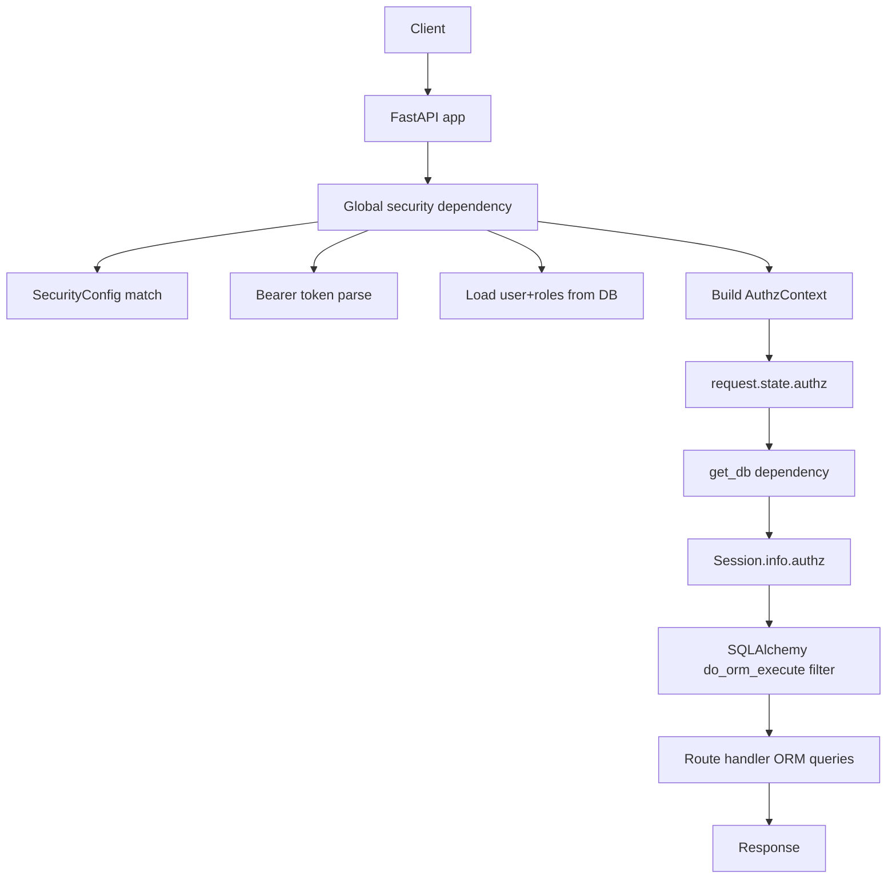

## How this demo works (request + security flow)

This document explains how the **config-first route security** works in this repo, end-to-end, and where to look in code.

It covers:
- Startup (loading config + initializing DB)
- Per-request authn/authz
- “Least disruption” data filtering (department + sensitive rows) without changing query code
- Optional decorator-based example routes

---

## High-level architecture



Key idea: **route handlers keep normal SQLAlchemy queries**; row filtering happens transparently in the ORM layer.

---

## Startup flow

Startup is defined in [`/Users/gsr/dev/learning/GitHub/python_routes_security/app/main.py`](/Users/gsr/dev/learning/GitHub/python_routes_security/app/main.py):

```13:28:/Users/gsr/dev/learning/GitHub/python_routes_security/app/main.py
def create_app() -> FastAPI:
    # Global dependency: applies security with zero changes to route handlers.
    app = FastAPI(dependencies=[Depends(enforce_security)])
    ...
    @app.on_event("startup")
    def _startup() -> None:
        settings = get_settings()
        app.state.security_config = load_security_config(settings.resolved_security_config_path())
        init_db()
```

### What happens on startup
- **SQLAlchemy filters are registered** by importing `app.db.filters` (side effect).
- `security_config.yaml` is loaded and validated, then stored in `app.state.security_config`.
- SQLite tables are created and seeded via `init_db()`.

---

## Request flow (config-driven security)

### 1) Global security is enforced for every request
The app is constructed with a global dependency:
- `FastAPI(dependencies=[Depends(enforce_security)])`

That means every request hits `enforce_security()` from:
- [`/Users/gsr/dev/learning/GitHub/python_routes_security/app/security/dependencies.py`](/Users/gsr/dev/learning/GitHub/python_routes_security/app/security/dependencies.py)

### 2) Route rule is selected from config
`enforce_security()` reads `request.url.path` and `request.method`, then calls:
- `config.match(path, method)`

Route matching is implemented in:
- [`/Users/gsr/dev/learning/GitHub/python_routes_security/app/security/config.py`](/Users/gsr/dev/learning/GitHub/python_routes_security/app/security/config.py)

The configuration lives in:
- [`/Users/gsr/dev/learning/GitHub/python_routes_security/config/security_config.yaml`](/Users/gsr/dev/learning/GitHub/python_routes_security/config/security_config.yaml)

### 3) Auth is required? then parse Bearer token (demo stub)
If the rule requires auth, `enforce_security()` calls:
- `extract_user_id(request, config)`

Demo behavior is defined in:
- [`/Users/gsr/dev/learning/GitHub/python_routes_security/app/security/auth.py`](/Users/gsr/dev/learning/GitHub/python_routes_security/app/security/auth.py)

It expects:
- `Authorization: Bearer <token>`
- In this demo: `<token>` must be an integer `user_id`

### 4) Load user + roles from DB (demo stub for Azure AD)
`enforce_security()` then calls:
- `load_user(db, user_id)`

This loads the user and role relationships from the SQLite DB.

### 5) Check role access
Required roles come from:
- config rule `required_roles`
- plus optional decorator metadata (see next section)

If the user lacks required roles, `enforce_security()` returns `403`.

### 6) Derive “capabilities” from config only
This project does **not** store permissions in DB.
Instead, it derives capabilities from role→capability mapping in config:
- `permissions.view_sensitive_data.roles: [...]`
- `permissions.view_cross_department.roles: [...]`

This is computed by `_derive_permissions()` in `dependencies.py`.

### 7) Build `AuthzContext` and attach to request
Finally, `enforce_security()` builds an `AuthzContext` and stores it in:
- `request.state.authz`

This is the bridge into SQLAlchemy query filtering.

---

## “Least disruption” data filtering (department + sensitive rows)

### How the `AuthzContext` reaches the ORM

1) Route handlers depend on `get_db`:
- `db: Session = Depends(get_db)`

2) `get_db` reads `request.state.authz` and stores it on the SQLAlchemy session:
- `db.info["authz"] = authz`

That logic is in:
- [`/Users/gsr/dev/learning/GitHub/python_routes_security/app/db/session.py`](/Users/gsr/dev/learning/GitHub/python_routes_security/app/db/session.py)

### Where filtering actually happens

SQLAlchemy event hook:
- `@event.listens_for(Session, "do_orm_execute")`

Implemented in:
- [`/Users/gsr/dev/learning/GitHub/python_routes_security/app/db/filters.py`](/Users/gsr/dev/learning/GitHub/python_routes_security/app/db/filters.py)

When a SELECT executes, it applies `with_loader_criteria(...)` filters to:
- restrict rows to `department_id == user.department_id` when department filtering is enabled
- hide rows where `is_sensitive == True` if sensitive access is required but user lacks `view_sensitive_data`

This is why route handlers can stay “normal”:

```21:24:/Users/gsr/dev/learning/GitHub/python_routes_security/app/routers/employees.py
@router.get("/employees", response_model=list[EmployeeOut])
def list_employees(db: Session = Depends(get_db)) -> list[Employee]:
    # Filters are applied transparently via app/db/filters.py based on request authz.
    return list(db.scalars(select(Employee).order_by(Employee.id)).all())
```

---

## Decorator demo (optional alternative example)

This repo also includes a small decorator-based style to show how you *could* annotate routes.
It’s not the primary approach; it exists as a sample.

Example routes:
- [`/Users/gsr/dev/learning/GitHub/python_routes_security/app/routers/decorator_demo.py`](/Users/gsr/dev/learning/GitHub/python_routes_security/app/routers/decorator_demo.py)

The decorators attach metadata onto the endpoint function, which `enforce_security()` reads from:
- `request.scope["endpoint"]`

This is why the decorator demo can work even without adding explicit entries to `security_config.yaml`.

---

## Endpoints to try

- Public:
  - `GET /health`
- Auth + config-driven authorization:
  - `GET /me`
  - `GET /employees`
  - `GET /employees/{id}`
  - `GET /performance-reviews`
  - `GET /admin/users`
- Decorator demo:
  - `GET /decorator-demo/employees`
  - `GET /decorator-demo/performance-reviews`

---

## Production note (where Azure AD fits)

In production you would replace the demo `extract_user_id()` + DB role loading with:
- JWT validation (issuer/audience/signature/expiry)
- role extraction from Azure AD token claims (app roles / groups)
- then building the same `AuthzContext` shape

See [`/Users/gsr/dev/learning/GitHub/python_routes_security/PRODUCTION.md`](/Users/gsr/dev/learning/GitHub/python_routes_security/PRODUCTION.md).

