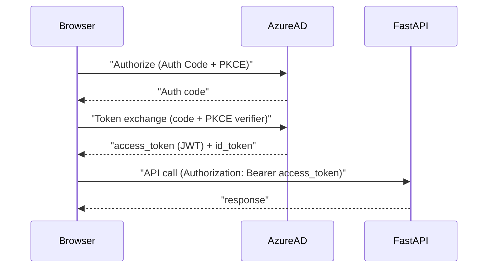

## Production SSO → FastAPI (secure handoff)

This project’s demo uses `Authorization: Bearer <token>` where `<token>` is treated as an integer `user_id`.
In production, the frontend will authenticate users via SSO (Azure AD / Microsoft Entra ID) and pass a **real access token** to FastAPI.

This document describes **recommended** secure patterns and the minimum backend validations required.

---

## Recommended approach (SPA): Authorization Code + PKCE

For a browser-based frontend (SPA), the recommended modern flow is:
- **OpenID Connect / OAuth2 Authorization Code Flow with PKCE**
- Frontend obtains an **access token** for your API
- Frontend calls FastAPI with `Authorization: Bearer <access_token>`
- FastAPI validates the JWT and authorizes requests

### Data flow

---

## How the frontend should pass identity to FastAPI

### Option A (common): Bearer access token (JWT) to API
Send on every request:
- Header: `Authorization: Bearer <access_token>`

Notes:
- Use **HTTPS only**
- Keep tokens **out of localStorage** if you can (prefer in-memory + silent refresh)

### Option B (most secure for SPAs): Backend-for-Frontend (BFF)
Instead of putting access tokens in the browser:
- Browser authenticates with SSO
- Browser only holds a **same-site, httpOnly session cookie** (not readable by JS)
- BFF server (or gateway) holds tokens server-side and calls the API

This reduces XSS token theft risk and simplifies CSRF protections (still required, but more manageable).

---

## What FastAPI must validate (minimum bar)

When receiving `Authorization: Bearer <token>`, FastAPI should:

- **Verify the JWT signature** using Azure AD’s JWKS (public keys)
- **Verify issuer** (`iss`) matches your tenant authority
- **Verify audience** (`aud`) matches your API application/client ID URI
- **Verify token lifetime** (`exp`, `nbf`, clock skew)
- **Verify token type / scopes**:
  - For delegated user access: check `scp` (scopes)
  - For app-only access: check `roles` (app roles)
- **Reject** unsigned tokens, tokens with wrong issuer/audience, expired tokens, or tokens missing required scope/role

Operational guidance:
- **Cache JWKS** with a TTL (avoid fetching keys on every request)
- Log authentication failures at a rate-limited level (avoid log noise/DoS)

---

## Roles and “who can access what”

You typically have two sources for role-like authorization data:

### 1) App Roles (recommended for APIs)
Configure **App Roles** in the Azure AD App Registration for the API.
Then tokens can contain a `roles: ["admin", "hr_manager"]` claim.

Pros:
- Stable and explicit
- Works well for backend authorization

### 2) Group membership (use carefully)
Using Azure AD groups can yield `groups` claims, but large memberships can trigger “overage” (token contains a reference, not full list).

If you rely on groups:
- Handle overage by calling Microsoft Graph (server-side) to fetch group memberships

---

## Mapping SSO roles to this project’s model

In this repo, authorization is expressed as:
- **Route rules**: required roles for endpoints (config-driven)
- **Capabilities**: `view_sensitive_data`, `view_cross_department` derived from roles via config
- **Data scoping**: department filtering + sensitive row filtering (server-side enforced)

Production mapping:
- Token validation yields a `UserPrincipal` (subject + roles + department claim or lookup)
- Roles in token drive route access and capability derivation
- Department can be:
  - a token claim (preferred if stable), or
  - looked up server-side (DB / directory / HR system) using the token subject

---

## Implementation notes (no code in this doc)

Frontend (Azure AD):
- Use MSAL for your frontend framework:
  - JS: `@azure/msal-browser` (and framework wrapper)
- Request an access token for your API scope, e.g. `api://<api-app-id>/access_as_user`

FastAPI:
- Use a Bearer auth scheme and validate JWTs.
- Popular Python libraries:
  - `PyJWT[crypto]`
  - `python-jose[cryptography]`

Gateway (optional, recommended in larger systems):
- Validate tokens at API gateway (first line of defense)
- Still validate or at least verify claims server-side for defense in depth

---

## Security checklist

- **HTTPS enforced** end-to-end
- **CORS** restricted to your frontend origins
- **No access tokens in localStorage** (prefer in-memory or BFF)
- **Short-lived access tokens**, refresh handled via silent refresh or BFF
- **Validate issuer/audience/signature/exp** for every request
- **Least privilege**: endpoints require explicit roles/scopes
- **Audit logging** for sensitive endpoint access and sensitive data reads

