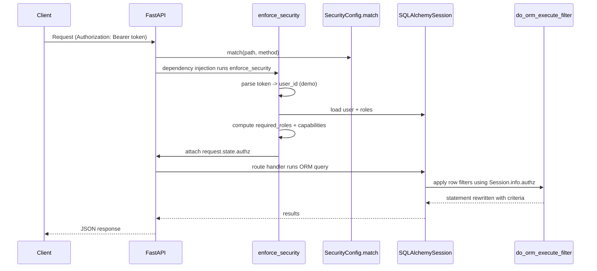

## Security module deep dive (Java → Python mental model)

This repo demonstrates **config-first** security in FastAPI with **minimal disruption**:
- Route handlers don’t need to be rewritten for security.
- Security is applied globally via a FastAPI dependency (`enforce_security`).
- Data is filtered transparently at the ORM layer (department + sensitive rows).

If you come from a Java/Spring background, think of this as:
- **`enforce_security`** ≈ a `OncePerRequestFilter`/`HandlerInterceptor` hybrid, but implemented using FastAPI’s **dependency injection** (DI)
- **`request.state`** ≈ `HttpServletRequest.setAttribute(...)`
- **`AuthzContext`** ≈ a small `SecurityContext` object (but stored on the request + SQLAlchemy Session)
- **SQLAlchemy `do_orm_execute` hook** ≈ a repository-layer “automatic predicate injection” for row-level security

Related docs:
- Overall system flow: [`FLOW.md`](/Users/gsr/dev/learning/GitHub/python_routes_security/FLOW.md)
- Production SSO notes: [`PRODUCTION.md`](/Users/gsr/dev/learning/GitHub/python_routes_security/PRODUCTION.md)

---

## Where the security code lives

Primary modules:
- [`app/security/auth.py`](/Users/gsr/dev/learning/GitHub/python_routes_security/app/security/auth.py) — *authentication primitives* (token parsing + user loading)
- [`app/security/dependencies.py`](/Users/gsr/dev/learning/GitHub/python_routes_security/app/security/dependencies.py) — *authorization + request context building*

Supporting modules:
- [`app/security/config.py`](/Users/gsr/dev/learning/GitHub/python_routes_security/app/security/config.py) — config schema + route matching
- [`app/security/context.py`](/Users/gsr/dev/learning/GitHub/python_routes_security/app/security/context.py) — the `AuthzContext` dataclass
- [`app/security/decorators.py`](/Users/gsr/dev/learning/GitHub/python_routes_security/app/security/decorators.py) — optional decorator metadata (example style)

---

## High-level request flow



Important timing detail (vs Spring filters):
- Dependencies run **after routing** has selected the endpoint, but **before the endpoint function executes**.
- This allows reading endpoint metadata via `request.scope["endpoint"]` (used for decorator demo support).

---

## `auth.py` — authentication primitives

### `extract_user_id(request, config)`
File: [`app/security/auth.py`](/Users/gsr/dev/learning/GitHub/python_routes_security/app/security/auth.py)

What it does:
- Reads the authorization header configured by `SecurityConfig`:
  - `Authorization: Bearer <token>`
- In this **demo**, treats `<token>` as an **integer** `user_id`.
- Emits logs **without ever logging the token**.
- Raises `HTTPException(400)` for malformed headers, and returns `None` if header missing.

Java analogy:
- Similar to extracting `Principal` / token from `Authorization` header in a `OncePerRequestFilter`.

Key snippet:

```15:55:/Users/gsr/dev/learning/GitHub/python_routes_security/app/security/auth.py
def extract_user_id(request: Request, config: SecurityConfig) -> int | None:
    header_name = config.auth.authorization_header
    bearer_prefix = config.auth.bearer_prefix
    raw = request.headers.get(header_name)
    if not raw:
        return None
    ...
    return int(token)
```

Production note:
- In production you would validate a JWT and extract `sub` / roles from token claims (see `PRODUCTION.md`).

### `load_user(db, user_id)`
What it does:
- Looks up the user row by `id`.
- Eager-loads `department` and `roles` (so role checks don’t trigger N+1 queries).
- Raises `HTTPException(401)` if user missing/inactive.

Java analogy:
- Similar to a `UserDetailsService.loadUserByUsername(...)` + attaching authorities.

Key snippet:

```50:63:/Users/gsr/dev/learning/GitHub/python_routes_security/app/security/auth.py
def load_user(db: Session, user_id: int) -> User:
    user = db.execute(
        select(User)
        .where(User.id == user_id)
        .options(
            selectinload(User.department),
            selectinload(User.roles),
        )
    ).scalar_one_or_none()
    if user is None or not user.is_active:
        raise HTTPException(status_code=status.HTTP_401_UNAUTHORIZED, detail="Invalid or inactive user")
    return user
```

---

## `dependencies.py` — authorization + request context

### FastAPI dependency injection (DI) in one sentence
FastAPI inspects function signatures and injects values based on:
- types like `Request` (special-injected)
- `Depends(...)` declarations (dependency graph)

### `get_security_config(request)`
What it does:
- Returns the loaded `SecurityConfig` from `app.state.security_config`.

Java analogy:
- Like reading a singleton bean from the application context.

```17:21:/Users/gsr/dev/learning/GitHub/python_routes_security/app/security/dependencies.py
def get_security_config(request: Request) -> SecurityConfig:
    config = getattr(request.app.state, "security_config", None)
    ...
    return config
```

### `get_current_user(request)`
What it does:
- Returns `request.state.user` set by `enforce_security`.
- If not set, returns `401`.

Java analogy:
- Like `SecurityContextHolder.getContext().getAuthentication()` with a guard.

```24:28:/Users/gsr/dev/learning/GitHub/python_routes_security/app/security/dependencies.py
def get_current_user(request: Request) -> User:
    user = getattr(request.state, "user", None)
    if user is None:
        raise HTTPException(status_code=status.HTTP_401_UNAUTHORIZED, detail="Authentication required")
    return user
```

### `enforce_security(request, config, db)`
This is the core of the security module.

Where it is used:
- The FastAPI app registers it as a **global dependency** so it runs for every request:
  - See [`app/main.py`](/Users/gsr/dev/learning/GitHub/python_routes_security/app/main.py)

```36:37:/Users/gsr/dev/learning/GitHub/python_routes_security/app/main.py
app = FastAPI(dependencies=[Depends(enforce_security)], lifespan=lifespan)
```

What it does (step-by-step):

1) **Resolve the effective rule** for the request
- Uses config-based route matching:
  - `rule = config.match(path, method)`

2) **Optional decorator metadata** (example style)
- Reads `request.scope["endpoint"]` and checks for attributes like:
  - `__security_required_roles__`
  - `__security_filter_by_department__`
  - `__security_require_sensitive_permission__`

This only works because dependencies run **after routing**.

3) **If auth is not required**, return early
```55:58:/Users/gsr/dev/learning/GitHub/python_routes_security/app/security/dependencies.py
auth_required = rule.auth_required or bool(decorator_roles) or decorator_filter_dept or decorator_sensitive
if not auth_required:
    return
```

4) **Authentication**: parse token → `user_id` (demo)
- `user_id = extract_user_id(request, config)`
- `user = load_user(db, user_id)`
- Store `user` on the request: `request.state.user = user`

5) **Authorization**: role check
- Build:
  - `user_roles` from DB
  - `required_roles` from config + decorators
- Enforce “any-of” role logic (set intersection)

6) **Capabilities** (config-only)
- This repo intentionally does **not** store permissions in DB.
- Capabilities are derived from role→capability mapping in `security_config.yaml`:
  - `view_sensitive_data`
  - `view_cross_department`

7) **Build and store `AuthzContext`**
- Stored at `request.state.authz`
- Contains:
  - identity (`user_id`, `department_id`, `roles`)
  - capabilities (derived)
  - scope flags:
    - `filter_by_department`
    - `require_sensitive_permission`

Key snippet:

```31:111:/Users/gsr/dev/learning/GitHub/python_routes_security/app/security/dependencies.py
def enforce_security(...):
    rule = config.match(path, method)
    ...
    user = load_user(db, user_id)
    request.state.user = user
    ...
    if required_roles and not (user_roles & required_roles):
        raise HTTPException(status_code=status.HTTP_403_FORBIDDEN, ...)
    ...
    request.state.authz = AuthzContext(...)
```

---

## Route matching (config-first)

Configuration file:
- [`config/security_config.yaml`](/Users/gsr/dev/learning/GitHub/python_routes_security/config/security_config.yaml)

Route matching logic:
- [`app/security/config.py`](/Users/gsr/dev/learning/GitHub/python_routes_security/app/security/config.py)

How matching works:
- Exact matches are attempted first (fast path).
- Then template matches (`/employees/{id}`) are evaluated using a compiled regex.

Java analogy:
- Similar to how Spring maps `@GetMapping("/employees/{id}")`, but we’re re-implementing a small subset for config-driven rules.

---

## How department/sensitive filtering happens “without changing queries”

This repo’s “least disruption” trick is:
1) Put an `AuthzContext` onto `request.state.authz`.
2) Copy it into the SQLAlchemy Session (`Session.info["authz"]`) inside the DB dependency.
3) Use a SQLAlchemy event hook to inject filtering criteria for every SELECT.

### Step 1+2: `get_db` attaches authz to the SQLAlchemy session
File: [`app/db/session.py`](/Users/gsr/dev/learning/GitHub/python_routes_security/app/db/session.py)

```22:38:/Users/gsr/dev/learning/GitHub/python_routes_security/app/db/session.py
def get_db(request: Request) -> Generator[Session, None, None]:
    db = SessionLocal()
    try:
        authz = getattr(getattr(request, "state", None), "authz", None)
        if authz is not None:
            db.info["authz"] = authz
        yield db
    finally:
        db.close()
```

Java analogy:
- Similar to storing security context in a thread-local, except here we attach it to the DB session explicitly.

### Step 3: SQLAlchemy adds filters automatically on SELECT
File: [`app/db/filters.py`](/Users/gsr/dev/learning/GitHub/python_routes_security/app/db/filters.py)

```11:48:/Users/gsr/dev/learning/GitHub/python_routes_security/app/db/filters.py
@event.listens_for(Session, "do_orm_execute")
def _apply_authorization_filters(execute_state) -> None:
    if not execute_state.is_select:
        return
    authz = execute_state.session.info.get("authz")
    if authz is None:
        return
    ...
```

Filters applied:
- **Department**: add `department_id == authz.department_id` if filtering enabled and user can’t view cross-department.
- **Sensitive rows**: add `is_sensitive == False` if sensitive filtering required but user lacks `view_sensitive_data`.

Result:
- Route code can remain “vanilla ORM”, e.g. `select(Employee)`, and still be scoped correctly.

---

## Common pitfalls for Java devs new to FastAPI

- **Dependency timing**: dependencies run before the endpoint (think “pre-handle”), but after routing.
- **`Request` injection requires the exact type**:
  - `request: Request` works
  - `request: Request | None` may break DI and cause confusing errors
- **`request.state` is per-request**:
  - Don’t store global state there
  - It’s safe to store derived context for the current request
- **Never log secrets**:
  - This repo logs path/method/user_id, but never the bearer token.

---

## Quick “where do I look?” map

- Token parsing: `app/security/auth.py::extract_user_id`
- Role check + build auth context: `app/security/dependencies.py::enforce_security`
- Config rules and matching: `app/security/config.py`
- Authz context structure: `app/security/context.py`
- Transparent DB filtering: `app/db/session.py` + `app/db/filters.py`

